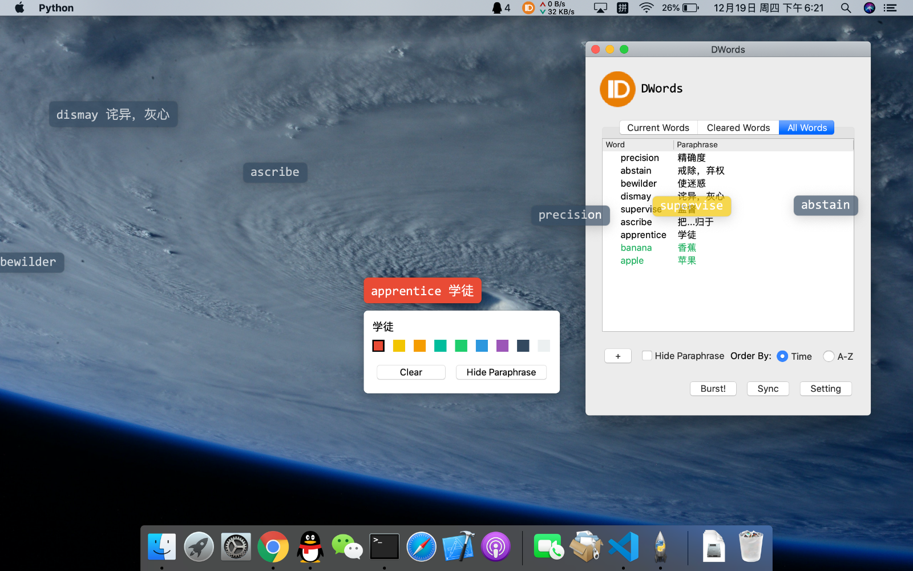

<p align="center"></p>
<h1 align="center">DWords</h1>
<p align="center">Show words as Danmaku on the screen to helps you remember them.</p>

[](https://pypi.org/project/DWords/)
[](https://travis-ci.org/luyuhuang/DWords)
[](https://codecov.io/gh/luyuhuang/DWords)
[](https://github.com/luyuhuang/DWords/blob/dev/LICENSE)



[简体中文](README_cn.md)

## Introduction

DWords is a cross platform tool which show words as Danmaku on your screen to helps you remember them. The main purpose of DWords is to help non-English-speaking people study English, but not limited to English, you can also use it to remember anything you want.

Features:

- Open source and cross platform
- Memorize words with ubiquitous Danmakus while using a computer
- Synchronize between multiple devices by email
- Add words using you phone by email
- Included dictionaries

## Installation

DWords is written by Python3, we recommend install via pip. Please make sure your machine has been installed Python3.

Running the following in your terminal and DWords is installed:

```sh
pip3 install DWords
```

You can also install from source code:

```sh
git clone https://github.com/luyuhuang/DWords.git
cd DWords
git checkout master
python3 setup.py install
```

If you don't know Python, we also provide binary distributions for Windows. Click [here](https://github.com/luyuhuang/DWords/releases) to download it. Caution, binary distributions may not be trusted by antivirus software.

## Usage

Type `DWords` in you terminal to start DWords. If you downloaded binary distributions, double click `DWords.exe` to start it.

### Add words

Click "+" button and enter in the input box below to add words. The format is: the first line is the word, the second line is a short explanation and followed by detailed explanations. The short explanation can be displayed directly on the Danmaku, while the detailed explanation can only be displayed on the details panel. Detailed explanation is optional. For example:

```
word
a unit of language
a unit of language that native speakers can identify; a brief statement.
```

And then click "Commit" button to add it, or press Ctrl + Enter.

### Using dictionary

DWords included dictionaries, click "Setting" button and set it in the "Common" tab. Currently only English-Chinese dictionary is supported, including more than 30,000 words. Once setting up the dictionary, the explanation will appear automatically when you press Enter while input a word.

### Synchronize

DWords can synchronize words between multiple devices. In order to use this feature, you need to set up an account first. Click "Setting" button and set the email address, email password, SMTP server and POP3 server in the "Account" tab. DWords'll synchronize data via send emails, so we recommend using an infrequently used mailbox.

### Add words by email

Once setting up the account, you can add add words by sending email to the set up mailbox. Edit a email using any email client, with the subject "DWords add" and the format of content is similar to add words, but you can add more then one words, separated by triple dash "---" or triple comma ",,,"; Triple swung dash "~~~" or triple dot "..." tells DWords it's the end. For example:

```
world
世界
---
word
单词
,,,
hello
你好
...
The content after "..." will be ignored.
```

Then send the email to the mailbox you set up.

If you have set up the dictionary, you don't have to specify the explanation and DWords'll consult the dictionary automatically.

## Contribution

If you found any problems or have any suggestions, open an [issue](https://github.com/luyuhuang/DWords/issues). We also welcome all kinds of pull requests.

## License

DWords is distributed under the [GPLv3 License](https://github.com/luyuhuang/DWords/blob/dev/LICENSE) since PyQt5 is licensed under the GPLv3 (so we have no choice). You can use it for free and modify it freely, but when you modify it you have to open source with the same license.
